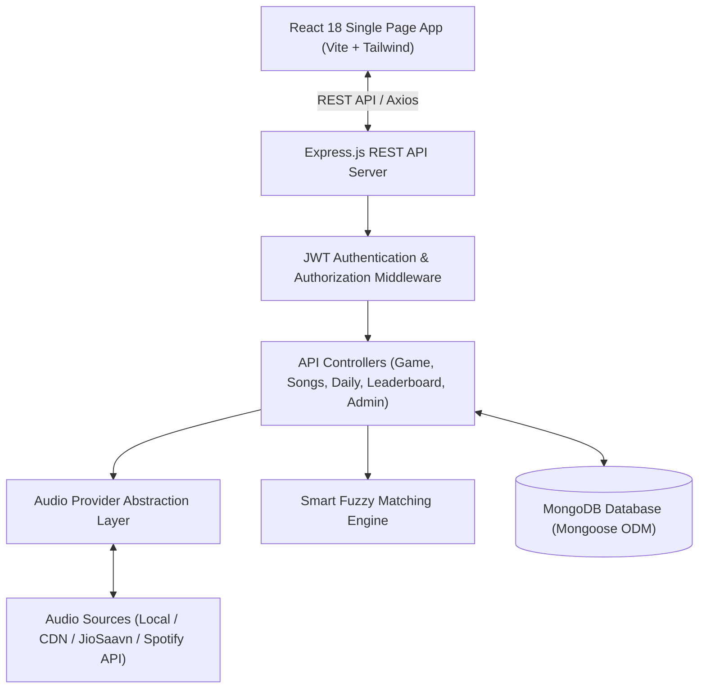

# 🎵 GaanaSpot (गानाSpot)

> **"How quickly can you recognize the song?"**
>
> A fast-paced, competitive Hindi/Bollywood song guessing web application inspired by Heardle and Songlio. Listen to micro-snippets of iconic Bollywood tracks, guess the song in the fewest attempts, protect your daily streak, and climb the leaderboard!

---


---

## 📖 Table of Contents

- [Overview](#-overview)
- [Features](#-features)
- [How It Works](#-how-it-works)
- [Tech Stack](#-tech-stack)
- [Architecture](#-architecture)
- [Project Structure](#-project-structure)
- [Prerequisites](#-prerequisites)
- [Installation](#-installation)
- [Environment Setup](#-environment-setup)
- [Database Setup & Seeding](#-database-setup--seeding)
- [Running the Application](#-running-the-application)
- [Default Credentials](#-default-credentials)
- [API Documentation](#-api-documentation)
- [Audio Provider Architecture](#-audio-provider-architecture)
- [Scoring System](#-scoring-system)
- [Smart Matching Engine](#-smart-matching-engine)
- [Deployment](#-deployment)
- [Roadmap & Future Improvements](#-roadmap--future-improvements)
- [Contributing](#-contributing)
- [License](#-license)

---

## 🌟 Overview

**GaanaSpot** puts your Bollywood music knowledge to the ultimate test. Players listen to progressively longer audio clips of Hindi songs—starting from a fraction of a second—and must identify the song title or movie as quickly as possible.

Whether you grew up on 90s Kishore Kumar and Kumar Sanu melodies, danced to 2000s Bollywood party hits, or vibe to modern Arijit Singh and Diljit Dosanjh tracks, GaanaSpot brings the rich catalog of Indian cinema music into an addictive, gamified experience.

```
Clip 1:  0.1s  ───►  Guess 1 (1200 pts)
Clip 2:  0.5s  ───►  Guess 2 (975 pts)
Clip 3:  2.0s  ───►  Guess 3 (750 pts)
Clip 4:  8.0s  ───►  Guess 4 (525 pts)
Clip 5: 15.0s  ───►  Guess 5 (300 pts)
```

> **No login required!** Just open the app and start playing immediately.

### ⚡ Quick Start (3 steps)

```bash
# Step 1: Install everything
cd gaanaspot/server && npm install && cd ../client && npm install && cd ..

# Step 2: Seed the database (needs MongoDB running)
cp .env.example server/.env
cd server && npm run seed && cd ..

# Step 3: Run (use 2 terminal windows)
cd server && npm run dev     # Terminal 1 → http://localhost:5000
cd client && npm run dev     # Terminal 2 → http://localhost:5173
```

Open **http://localhost:5173** and play!

---

## ✨ Features

- 🎵 **Daily 5** — 5 fresh, curated Bollywood tracks every single day at midnight. Everyone around the world plays the same daily challenge!
- 🎮 **Practice Mode** — Unlimited gameplay on demand. Filter by decades (70s, 80s, 90s, 2000s, 2010s, 2020s), genres (Romantic, Dance/Party, Sad, Sufi, Retro, Indie), and difficulty levels (Easy, Medium, Hard).
- 🏆 **Leaderboard** — Global and friend leaderboards with daily, weekly, monthly, and all-time rankings based on score and speed.
- 🔥 **Daily Streak** — Track your daily puzzle habit with streak counters, streak milestones, and streak saver protections.
- ⚡ **Challenge Friends** — Create custom multiplayer challenge rooms or share custom challenge links to see who can identify the track faster.
- 👤 **User Profile & Stats** — In-depth stats tracking win rate, average guess count, guess distribution graph, total points, and unlockable achievement badges.
- 🎯 **Smart Matching** — Intelligent search algorithm that tolerates typos, phonetic spelling variations (Hinglish/Romanized Hindi), alternate titles, and movie names.
- 🛡️ **Admin Dashboard** — Complete administrative control to manage songs (add, edit, delete), preview audio clips, upload bulk songs, moderate users, and view platform metrics.
- 📱 **Fully Responsive** — Mobile-first, touch-friendly UI designed for seamless play on smartphones, tablets, and desktop browsers.
- 🌙 **Dark Theme UI** — Spotify-inspired dark aesthetic featuring neon green accents, glassmorphic cards, smooth waveforms, and dynamic audio visualizers.

---

## 🕹️ How It Works

1. **Listen to the Snippet**: Tap play to hear the first audio snippet (just **0.1 seconds**!).
2. **Search & Guess**: Start typing the song title, artist, or movie name. The smart search will suggest matching Bollywood tracks.
3. **Unlock More Audio**: If you're unsure, hit **Skip** or submit an incorrect guess to unlock a longer audio snippet (**0.5s**, **2s**, **8s**, and finally **15s**).
4. **Score Points**: The earlier you guess correctly, the more points you score!
5. **Share Your Scorecard**: Share your emoji-based result grid on WhatsApp, Twitter/X, and Instagram without spoiling the song title.

---

## 🛠️ Tech Stack

| Layer | Technology | Description |
|-------|------------|-------------|
| **Frontend** | React 18 | Declarative component-based UI library |
| **Build Tool** | Vite | Lightning-fast build tool and dev server |
| **Styling** | Tailwind CSS | Utility-first CSS framework with dark theme palette |
| **Routing** | React Router v6 | Client-side routing for SPA navigation |
| **Icons** | Lucide React | Lightweight, consistent iconography |
| **HTTP Client** | Axios | Promise-based HTTP client with interceptors |
| **Audio Engine** | HTML5 Audio / Howler.js | Smooth audio playback, buffering, and snippet slicing |
| **Backend** | Node.js & Express.js | Robust REST API backend server |
| **Database** | MongoDB & Mongoose | Flexible NoSQL document database and ODM |
| **Authentication** | JWT & bcrypt | Stateless JSON Web Token authentication with hashed passwords |
| **Fuzzy Search** | Fuse.js / Levenshtein | Typo-tolerant string matching for Hindi/Romanized titles |

---

## 🏗️ Architecture

GaanaSpot is built on a clean, decoupled client-server architecture:



---

## 📁 Project Structure

```
gaanaspot/
├── .env.example                     # Environment configuration template
├── README.md                        # Project documentation
├── client/                          # React frontend application
│   ├── public/                      # Static assets (favicons, audio samples)
│   ├── src/
│   │   ├── assets/                  # Images, SVGs, and brand assets
│   │   ├── components/              # Reusable React components
│   │   │   ├── common/              # Buttons, Modals, Loaders, Toasts
│   │   │   ├── game/                # AudioPlayer, GuessInput, Scorecard, Waveform
│   │   │   ├── layout/              # Navbar, Sidebar, Footer, Layout wrapper
│   │   │   └── ui/                  # Cards, Badges, Tabs, Progress bars
│   │   ├── context/                 # Global state (AuthContext, GameContext)
│   │   ├── hooks/                   # Custom hooks (useAudio, useStreak, useDebounce)
│   │   ├── pages/                   # Application views
│   │   │   ├── AdminPage.jsx        # Admin dashboard & song manager
│   │   │   ├── ChallengePage.jsx    # Custom challenge multiplayer view
│   │   │   ├── DailyPage.jsx        # Daily 5 challenge mode
│   │   │   ├── HomePage.jsx         # Landing page & mode selection
│   │   │   ├── LeaderboardPage.jsx  # Global & friends rankings
│   │   │   ├── LoginPage.jsx        # User login
│   │   │   ├── PracticePage.jsx     # Endless practice mode with filters
│   │   │   ├── ProfilePage.jsx      # User profile, history & badges
│   │   │   └── RegisterPage.jsx     # User registration
│   │   ├── services/                # API and audio service layers
│   │   │   ├── api.js               # Axios instance with auth interceptors
│   │   │   └── audioService.js      # Audio controller and snippet playback
│   │   ├── utils/                   # Formatting, date, and share helpers
│   │   ├── App.jsx                  # Route definitions
│   │   ├── index.css                # Tailwind CSS imports & custom styles
│   │   └── main.jsx                 # React entry point
│   ├── index.html                   # HTML template
│   ├── package.json                 # Frontend dependencies & scripts
│   ├── postcss.config.js            # PostCSS configuration
│   ├── tailwind.config.js           # Tailwind theme & color extensions
│   └── vite.config.js               # Vite bundler configuration
└── server/                          # Express.js backend API
    ├── src/
    │   ├── config/                  # Database and JWT configuration
    │   │   ├── db.js                # MongoDB connection handler
    │   │   └── jwt.js               # Token generation and verify helpers
    │   ├── controllers/             # Request handling logic
    │   │   ├── adminController.js   # Admin CRUD and system stats
    │   │   ├── authController.js    # Register, login, user session
    │   │   ├── challengeController.js # Custom challenge generation & results
    │   │   ├── dailyController.js   # Daily 5 puzzle engine
    │   │   ├── gameController.js    # Practice game session management
    │   │   ├── leaderboardController.js # Ranking queries & aggregations
    │   │   ├── profileController.js # User profile, stats, achievements
    │   │   └── songController.js    # Song search, filter, and metadata
    │   ├── middleware/              # Express middlewares
    │   │   ├── authMiddleware.js    # JWT verification & role validation
    │   │   ├── errorMiddleware.js   # Global error handling
    │   │   └── validationMiddleware.js # Input sanitization & schema validation
    │   ├── models/                  # Mongoose data schemas
    │   │   ├── Challenge.js         # Custom challenge schema
    │   │   ├── DailyGame.js         # Daily game completion records
    │   │   ├── GameSession.js       # Individual practice session schema
    │   │   ├── Song.js              # Song catalog schema
    │   │   └── User.js              # User account & statistics schema
    │   ├── providers/               # Modular providers
    │   │   ├── audio/               # Audio source abstraction
    │   │   │   ├── baseAudioProvider.js
    │   │   │   ├── localAudioProvider.js
    │   │   │   └── saavnAudioProvider.js
    │   │   └── matching/            # Fuzzy matching engine
    │   │       └── fuzzyMatcher.js
    │   ├── routes/                  # Express route declarations
    │   │   ├── adminRoutes.js
    │   │   ├── authRoutes.js
    │   │   ├── challengeRoutes.js
    │   │   ├── dailyRoutes.js
    │   │   ├── gameRoutes.js
    │   │   ├── leaderboardRoutes.js
    │   │   ├── profileRoutes.js
    │   │   └── songRoutes.js
    │   ├── seeds/                   # Seed data & population scripts
    │   │   ├── seedData.js          # Bollywood songs catalog seed
    │   │   └── seedRunner.js        # Executable database seeder
    │   ├── utils/                   # Helper functions (streaks, scoring)
    │   └── index.js                 # Express application entry point
    ├── package.json                 # Backend dependencies & scripts
    └── .env.example                 # Server environment reference
```

---

## 📋 Prerequisites

Before running the application locally, ensure you have installed:

- **Node.js**: v18.0.0 or higher ([Download Node.js](https://nodejs.org/))
- **MongoDB**: v6.0 or higher running locally, or a free [MongoDB Atlas](https://www.mongodb.com/cloud/atlas) cluster connection URI
- **Package Manager**: `npm` (bundled with Node.js) or `yarn` / `pnpm`

---

## 🚀 Installation

1. **Clone the repository:**
   ```bash
   git clone https://github.com/your-username/gaanaspot.git
   cd gaanaspot
   ```

2. **Install Server Dependencies:**
   ```bash
   cd server
   npm install
   ```

3. **Install Client Dependencies:**
   ```bash
   cd ../client
   npm install
   ```

---

## ⚙️ Environment Setup

Copy the example environment configuration to create your local `.env` file:

```bash
# From the project root
cp .env.example server/.env
```

### Environment Variables Reference

| Variable | Required | Default | Description |
|---|:---:|---|---|
| `PORT` | No | `5000` | Port number the backend server listens on |
| `NODE_ENV` | No | `development` | Environment mode (`development`, `production`, `test`) |
| `MONGODB_URI` | **Yes** | `mongodb://localhost:27017/gaanaspot` | MongoDB connection string (Local or MongoDB Atlas) |
| `JWT_SECRET` | **Yes** | `your-super-secret-jwt-key-...` | Cryptographic secret key used to sign and verify JWT tokens |
| `JWT_EXPIRE` | No | `24h` | JWT expiration duration (e.g. `24h`, `7d`) |
| `CLIENT_URL` | **Yes** | `http://localhost:5173` | Allowed CORS origin for client web requests |
| `ADMIN_EMAIL` | **Yes** | `admin@gaanaspot.com` | Email for the initial admin account created by the seed script |
| `ADMIN_PASSWORD` | **Yes** | `admin123` | Password for the initial admin account |

---

## 🗄️ Database Setup & Seeding

1. **Start MongoDB**:
   - **Local MongoDB**: Ensure the MongoDB daemon is active (`brew services start mongodb-community` on macOS or `sudo systemctl start mongod` on Linux).
   - **MongoDB Atlas**: Paste your Atlas connection string into `server/.env` under `MONGODB_URI`.

2. **Seed the Database**:
   Populate the database with curated Bollywood songs, audio clip references, and an initial admin account:

   ```bash
   cd server
   npm run seed
   ```

   > **Output:**
   > ```
   > [INFO] Connected to MongoDB database: gaanaspot
   > [INFO] Cleared existing song and daily game collections...
   > [SUCCESS] Seeded 100+ Bollywood songs across 6 decades!
   > [SUCCESS] Created Admin user: admin@gaanaspot.com
   > [SUCCESS] Database seeding complete!
   > ```

---

## 🏃 Running the Application

Open two terminal windows to run both frontend and backend concurrently:

### Terminal 1: Backend Server
```bash
cd server
npm run dev
```
*Backend server will start at:* **`http://localhost:5000`**

### Terminal 2: Frontend Client
```bash
cd client
npm run dev
```
*Frontend application will be accessible at:* **`http://localhost:5173`**

---

## 🔑 Default Credentials

The seed script creates the following default accounts for testing:

| Role | Email | Password | Permissions |
|------|-------|----------|-------------|
| **Admin** | `admin@gaanaspot.com` | `admin123` | Full administrative access, Song CRUD, User management, Analytics |
| **Demo Player** | `player@gaanaspot.com` | `player123` | Standard player access, Daily 5, Practice, Leaderboard, Challenges |

---

## 📡 API Documentation

All API endpoints are prefixed with `/api`. Protected routes require a Bearer token in the `Authorization` header (`Authorization: Bearer <token>`).

### 🔐 Authentication (`/api/auth`)

| Method | Endpoint | Description | Auth Required |
|---|---|---|:---:|
| `POST` | `/api/auth/register` | Register a new user account | No |
| `POST` | `/api/auth/login` | Authenticate user & return JWT token | No |
| `GET` | `/api/auth/me` | Retrieve currently authenticated user profile | **Yes** |
| `PUT` | `/api/auth/update-password` | Update current user's password | **Yes** |

---

### 🎶 Songs (`/api/songs`)

| Method | Endpoint | Description | Auth Required |
|---|---|---|:---:|
| `GET` | `/api/songs` | List songs with pagination and filtering | Optional |
| `GET` | `/api/songs/search?q=:query` | Search song titles, movies, singers with smart autocomplete | No |
| `GET` | `/api/songs/filters` | Get available filter metadata (decades, genres, artists) | No |
| `GET` | `/api/songs/:id` | Fetch public metadata for a specific song | Optional |

---

### 🕹️ Game Sessions (`/api/game`)

| Method | Endpoint | Description | Auth Required |
|---|---|---|:---:|
| `POST` | `/api/game/start` | Initialize a new practice game session with optional filters | Optional |
| `POST` | `/api/game/guess` | Submit a song guess for the active session | Optional |
| `POST` | `/api/game/skip` | Skip current attempt to unlock longer audio snippet | Optional |
| `GET` | `/api/game/summary/:sessionId` | Get end-of-game summary, correct song details, and stats | Optional |

---

### 📅 Daily 5 Challenge (`/api/daily`)

| Method | Endpoint | Description | Auth Required |
|---|---|---|:---:|
| `GET` | `/api/daily/today` | Fetch today's Daily 5 puzzle set (audio clips only) | Optional |
| `POST` | `/api/daily/guess` | Submit guess for a daily song slot | Optional |
| `POST` | `/api/daily/complete` | Finalize daily game, calculate score, and update streak | **Yes** |
| `GET` | `/api/daily/history` | Retrieve user's historical daily puzzle completion records | **Yes** |
| `GET` | `/api/daily/streak` | Get current user's active streak & milestones | **Yes** |

---

### 🏅 Leaderboard (`/api/leaderboard`)

| Method | Endpoint | Description | Auth Required |
|---|---|---|:---:|
| `GET` | `/api/leaderboard/daily` | Top daily players for today's Daily 5 | No |
| `GET` | `/api/leaderboard/weekly` | Weekly ranked leaderboard | No |
| `GET` | `/api/leaderboard/monthly` | Monthly top scorers | No |
| `GET` | `/api/leaderboard/all-time` | All-time cumulative points leaderboard | No |

---

### 👤 User Profile & Stats (`/api/profile`)

| Method | Endpoint | Description | Auth Required |
|---|---|---|:---:|
| `GET` | `/api/profile/me` | Fetch detailed player statistics, achievements & history | **Yes** |
| `GET` | `/api/profile/:username` | View public profile card and stats of another player | No |
| `PUT` | `/api/profile` | Update user display name, avatar, and favorite decade | **Yes** |
| `GET` | `/api/profile/achievements` | List all unlocked & locked badges | **Yes** |

---

### ⚔️ Challenges (`/api/challenge`)

| Method | Endpoint | Description | Auth Required |
|---|---|---|:---:|
| `POST` | `/api/challenge/create` | Create a custom challenge room with selected song criteria | **Yes** |
| `GET` | `/api/challenge/:code` | Fetch challenge session by unique 6-character code | No |
| `POST` | `/api/challenge/:code/submit` | Submit score and attempts for a friend challenge | Optional |
| `GET` | `/api/challenge/:code/results` | View challenge scoreboard & head-to-head comparison | No |

---

### 🛡️ Admin Management (`/api/admin`)

| Method | Endpoint | Description | Auth Required |
|---|---|---|:---:|
| `GET` | `/api/admin/stats` | Platform analytics (total users, plays, popular songs) | **Admin** |
| `GET` | `/api/admin/songs` | Full song catalog with pagination & search | **Admin** |
| `POST` | `/api/admin/songs` | Add a new song to the catalog | **Admin** |
| `PUT` | `/api/admin/songs/:id` | Update existing song metadata & audio URL | **Admin** |
| `DELETE` | `/api/admin/songs/:id` | Remove song from catalog | **Admin** |
| `GET` | `/api/admin/users` | List registered users with ban/promote actions | **Admin** |
| `POST` | `/api/admin/seed-daily` | Trigger manual generation of upcoming daily sets | **Admin** |

---

## 🎧 Audio Provider Architecture

GaanaSpot is built with a flexible **Audio Provider Abstraction Layer** (`BaseAudioProvider`). This decouples the game engine from where audio files are hosted, allowing you to swap between local audio snippets, cloud object stores, or streaming APIs without altering game logic.

```
┌────────────────────────────────────────────────────────┐
│                   Game Controller                      │
└───────────────────────────┬────────────────────────────┘
                            │ requests clip (start, dur)
                            ▼
┌────────────────────────────────────────────────────────┐
│               BaseAudioProvider (Interface)            │
│   • getClipUrl(songId, attemptNumber)                  │
│   • getFullPreviewUrl(songId)                          │
│   • validateAudioSource(url)                           │
└────────────┬─────────────────────────────┬─────────────┘
             │                             │
    ┌────────▼─────────┐          ┌────────▼─────────┐
    │LocalAudioProvider│          │SaavnAudioProvider│
    │  (Static MP3s)   │          │  (JioSaavn API)  │
    └──────────────────┘          └──────────────────┘
```

### Implementing a Custom Audio Provider

You can easily plug in a new audio source (such as Cloudinary, AWS S3, or Spotify API) by extending `BaseAudioProvider`:

```javascript
// server/src/providers/audio/customAudioProvider.js
const BaseAudioProvider = require('./baseAudioProvider');

class CustomAudioProvider extends BaseAudioProvider {
  async getClipUrl(song, attemptNumber) {
    const durations = [0.1, 0.5, 2.0, 8.0, 15.0];
    const duration = durations[attemptNumber - 1] || 15.0;
    
    // Generate signed URL or query parameters for your custom CDN/service
    return `${song.audioBaseUrl}?start=${song.previewStartTime || 30}&duration=${duration}`;
  }

  async getFullPreviewUrl(song) {
    return song.fullAudioUrl || song.audioBaseUrl;
  }
}

module.exports = CustomAudioProvider;
```

---

## 🎯 Scoring System

Points are awarded based on how early the correct song is identified. Faster guesses receive maximum points:

| Attempt | Audio Heard | Maximum Points | Difficulty |
|:---:|:---:|:---:|:---:|
| **1st Guess** | `0.1s` | **1000 pts** | 🔥 Master |
| **2nd Guess** | `0.5s` | **800 pts** | ⚡ Expert |
| **3rd Guess** | `2.0s` | **600 pts** | 🎵 Pro |
| **4th Guess** | `8.0s` | **400 pts** | 👍 Intermediate |
| **5th Guess** | `15.0s` | **200 pts** | 👂 Casual |
| **Skipped / Failed** | Full Reveal | **0 pts** | ❌ Missed |

### Speed Bonus
- **Lightning Guess Bonus**: An extra **+50 bonus points** is awarded if a correct guess is locked in within **3 seconds** of starting the snippet.
- **Daily 5 Perfect Game**: Scoring 5000/5000 points unlocks the exclusive **"Sangeet Samrat"** badge.

---

## 🔍 Smart Matching Engine

Bollywood song titles are commonly transliterated from Hindi/Devanagari into English script in various ways (e.g., *"Tum Hi Ho"* vs *"Tumhi Ho"*, *"Chaiyya Chaiyya"* vs *"Chaiya Chaiya"*). 

GaanaSpot's Smart Matching Engine solves this by applying:

1. **Phonetic Normalization**: Strips punctuation, accents, and normalizes repeated vowel sounds.
2. **Levenshtein Distance & Fuzzy Search**: Matches close spelling mistakes and partial queries.
3. **Multi-Field Matching**: Searches across song title, movie/album name, primary singers, and famous lyrics aliases.
4. **Alias Resolution**: Maps popular colloquial names to official track titles (e.g., *"Kal Ho Naa Ho Title Track"* → *"Har Ghadi Badal Rahi Hai"*).

---

## 🚢 Deployment

### Frontend (Client)
The React client can be deployed to any static hosting provider (e.g., **Vercel**, **Netlify**, **Cloudflare Pages**):

```bash
cd client
npm run build
```
Deploy the generated `client/dist` directory. Set `VITE_API_URL` to your backend production URL.

### Backend (Server)
Deploy the Express API server to **Render**, **Railway**, **Fly.io**, or **Heroku**:

- **Build Command**: `npm install`
- **Start Command**: `npm start`
- Ensure all environment variables from `.env.example` are configured in the provider's dashboard.

### Database (MongoDB Atlas)
- Create a free M0 cluster on [MongoDB Atlas](https://www.mongodb.com/cloud/atlas).
- Whitelist your server's outbound IP addresses (or allow access from anywhere `0.0.0.0/0`).
- Provide the cluster connection URI in `MONGODB_URI`.

---

## 🔮 Roadmap & Future Improvements

- [ ] **Real-time Multiplayer Rooms**: Live 1v1 battle rooms with synchronized audio playback via WebSockets / Socket.io.
- [ ] **OAuth Social Sign-in**: One-click login with Google, Spotify, and Apple IDs.
- [ ] **Automated Catalog Sync**: Direct integration with JioSaavn and Spotify APIs for continuous song catalog expansion.
- [ ] **Custom Curated Playlists**: Play theme-specific playlists (e.g., *"90s Nostalgia"*, *"A.R. Rahman Classics"*, *"Punjabi Beats"*).
- [ ] **Social Feed & Following**: Follow friends, see their daily scores on your feed, and send song challenges.
- [ ] **Progressive Web App (PWA)**: Install GaanaSpot on mobile homescreens with offline practice caching.
- [ ] **Push Notifications**: Optional reminders to play before the daily streak resets at midnight.
- [ ] **Devanagari Language Toggle**: Switch UI and song search to Hindi (हिन्दी) script.
- [ ] **Song Request Queue**: User-submitted track requests with community upvoting.

---

## 🤝 Contributing

Contributions make the open-source community an amazing place to learn, inspire, and create. Any contributions you make are **greatly appreciated**!

1. Fork the Project
2. Create your Feature Branch (`git checkout -b feature/AmazingFeature`)
3. Commit your Changes (`git commit -m 'Add some AmazingFeature'`)
4. Push to the Branch (`git push origin feature/AmazingFeature`)
5. Open a Pull Request

---

## 📄 License

Distributed under the **MIT License**. See `LICENSE` for more information.

---

<div align="center">
  <sub>Made with ❤️ for Bollywood & Hindi music lovers everywhere.</sub>
</div>
